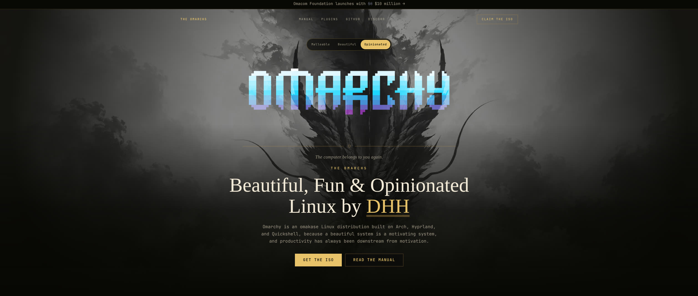

# Omarchy Landing Page Concept

A redesign concept for the [Omarchy](https://omarchy.org) landing page, built with Next.js, TypeScript, Tailwind CSS, and Motion.



This is a demo, not the production site. It rebuilds the homepage as three switchable experiences, each with its own hero wallpaper, voice, and section styling, built around David Heinemeier Hansson's own description of Omarchy as "beautiful, fun & opinionated":

- **Malleable**: the default, closest to the real production homepage
- **Beautiful**: a warm, painterly desktop-window treatment
- **Opinionated**: a gothic "Omarchs" fantasy-kingdom treatment

Switch between them with the pill control at the top of the hero; the choice is reflected in the URL (`?mode=beautiful` or `?mode=opinionated`) so a link can point straight at one. All other links (Manual, Security, News, Discord, and so on) point out to the real omarchy.org, since this app doesn't implement those routes.

## Getting Started

Install dependencies, then run the development server:

```bash
npm install
npm run dev
```

Open [http://localhost:3000](http://localhost:3000) in your browser to see the result.

## Project Structure

- `app/page.tsx` reads the `mode` search param and renders `ModeExperience`
- `app/components/ModeExperience.tsx` holds the switcher state, URL sync, and the crossfade between experiences
- `app/components/MalleableExperience.tsx`, `BeautifulExperience.tsx`, `OpinionatedExperience.tsx` are the three full-page treatments
- `app/components/WallpaperReveal.tsx` is the circular "grow from center" hero wallpaper transition
- `app/lib/landing-content.ts` holds the shared facts (headline, stats, quote) and the per-mode voice (eyebrows, captions)
- `app/lib/nav-links.ts` holds the shared nav and link data
- `public/` holds static assets, including the three hero wallpapers

## Scripts

- `npm run dev` starts the development server
- `npm run build` creates a production build
- `npm run start` runs the production build locally
- `npm run lint` runs ESLint
