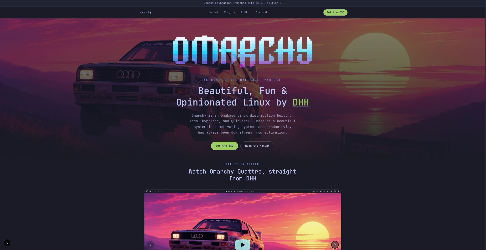

# Omarchy Landing Page Concept

A redesign concept for the [Omarchy](https://omarchy.org) landing page, built with Next.js, TypeScript, and Tailwind CSS.



This is a demo, not the production site. It rebuilds the homepage only: the hero, the video showcase, trust stats, and the link groups. All other links (Manual, Security, News, Discord, and so on) point out to the real omarchy.org.

## Getting Started

Install dependencies, then run the development server:

```bash
npm install
npm run dev
```

Open [http://localhost:3000](http://localhost:3000) in your browser to see the result.

## Project Structure

- `app/page.tsx` is the homepage
- `app/components/` holds the page sections (Hero, VideoPlayer, TrustStrip, LinkGroups, NavHeader, Footer)
- `app/lib/nav-links.ts` holds the shared nav and link data
- `public/` holds static assets, including the Quattro wallpaper used as the hero background

## Scripts

- `npm run dev` starts the development server
- `npm run build` creates a production build
- `npm run start` runs the production build locally
- `npm run lint` runs ESLint
